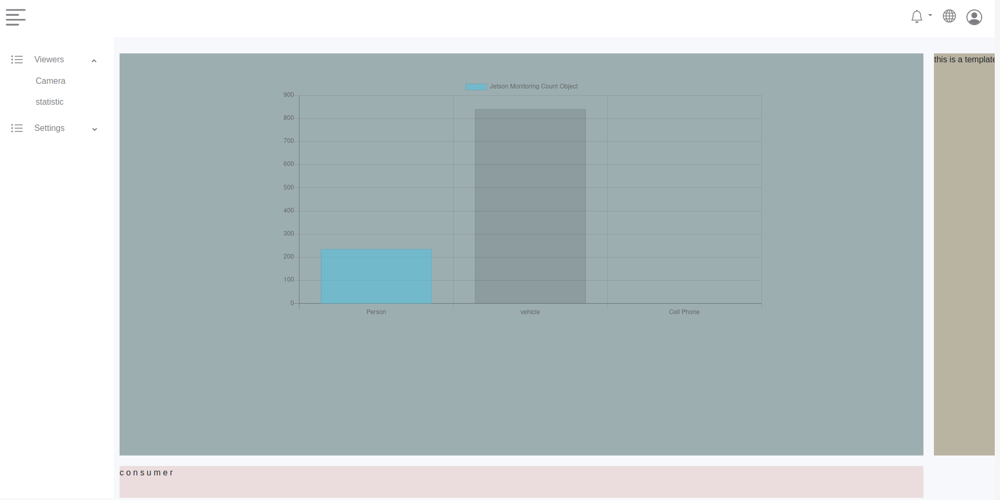

# DeepStream_SDK_Viewer
This App get Message Information delivery from Kafka-Producer using this [repository](https://github.com/romeolandry/DS_python_OD_IS) and count defined object that the Model have recognize. Using chartjs to show graphic representation fo analyse.

## Requirement

    Redis memory database have to be installed and configure.

    asgiref==3.3.1
    Django==3.1.7
    python-decouple==3.3
    pytz==2020.5
    sqlparse==0.4.1
    channels==3.0.3
    channels-redis==3.2.0

To install requirements

    $ pip install -r requirements.txt
Use `keygen.py` to generate the Production Secret key.

    $ python keygen.py

Create .env to keep Secret key and another configuration variable. Add the following Information
    
    #SECURITY WARNING: keep the secret key used in production secret!
    SECRET_KEY = 
    # Kafka configuraion
    BOOTSTRAP_SERVERS = 'IP_SERVER:KAfka_Port'
    AUTO_OFFSET_RESET = 'earliest' # Kafka method to get information from consumer

    # Redis Configuration
    REDIS_IP = 'Redis IP default is 127.0.0.1'
    REDIS_PORT = 'Redis PORT default is 6379'

Run the repository with the following command into the src directory

    $ python manage.py runserver

